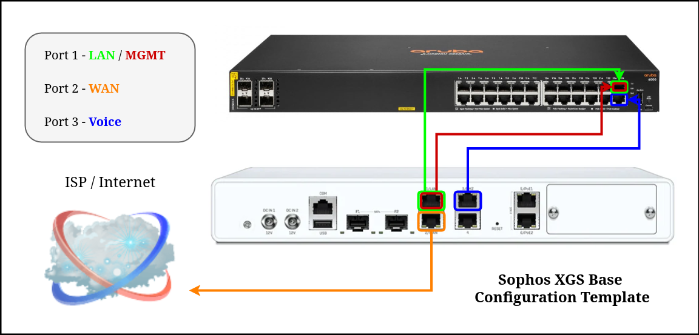

<p align="center">
    
</p>

# Sophos XGS Postman API Configuration Templates

This repository includes a couple templates for performing base configurations on Sophos XGS firewalls using the API and Postman.  Sophos released a [Postman collection](https://docs.sophos.com/nsg/sophos-firewall/21.0/Help/en-us/webhelp/onlinehelp/AdministratorHelp/BackupAndFirmware/API/HowToArticles/APIPostmanCollection/index.html) that includes many helpful examples and they also have detailed [API documentation](https://docs.sophos.com/nsg/sophos-firewall/21.0/api/index.html).

Being that I perform a large number of customer firewall configurations and deployments at work, I wanted a way to automate all the repititive tasks so that I can focus on the customer specifics.  The basic steps you will need to perform on the firewalls are as follows:

- Run through a minimal setup wizard to gain access to the GUI of the firewall.
    - Set the correct timezone during the setup wizard.  Changing this with an API call causes a reboot.
    - If the firewall has internet access, optionally register the device to Sophos Central and apply a license.
- Configure a spare port to use for API configuration (ie. Port 6 - LAN zone - 10.3.2.1/24).
    - LAN zone has HTTPS device access by default, which is needed for API configuration.
- Configure your device with a static IP on the same network as the API interface (ie. 10.3.2.2/24).
- Enable the API on the XGS firewall, and add your device IP as an allowed IP (ie. 10.3.2.2).
    - This can be done under Backup & Firmware >> API.
- Connect your device to the port setup for API configuration.

I usually have the device connected to the internet on Port 2 which is in the WAN zone and using DHCP by default.  This allows me to register the device to Sophos Central during the configuration wizard and apply the customer license or at least a 30 day evaluation.  Without an active license or evaluation, the call to enable the IPS switch will fail as that cannot be turned on without one.

These are only meant to be templates to build off of.  I won't go into detail about each API call in the request, but you should be able to review the two configurations and easily follow along with what they are doing.

[Sophos XGS Base Config](sophos-xgs-config-base.xml)
<br>
[Sophos XGS Voice Config](sophos-xgs-config-voice.xml)

Some customers have a DC that handles DHCP and DNS, some have VoIP service with us, some have multiple WANs, etc.  You'll have to adjust the variables and the API calls to what works for you, but hopefully this can be a helpful launch point.

---

### First off, download and install Postman, then launch it and create an account.

[Postman](https://www.postman.com/downloads/)

### Once installed, launched, and logged in, under the "My Workspace" section, click Collections >> Import.

Paste the following URL:

```
https://docs.sophos.com/nsg/sophos-firewall/api-collections/sophosfirewall.postman_collection.json
```

### Under "My Workspace", click on Collections and then click on and expand "Postman Collection for Sophos Firewall"

In the main window, click on the "Variables" tab:

- Update the "username" value to the default of "admin".
- Update the "password" value to the password you created during the firewall setup wizard.
- Update the "firewall-ip" value to the IP address of the API configuration port.
- Update the "firewall-port" value to port 4444 which is the default.
- Click "Save" at the top right.

### Test the API communication to the firewall.

Expand the "Authenticate" section under the Postman Collection for Sophos Firewall.

Click on "POST Sign In" and then hit "Send" near the top right.

The response window should update with an "Authentication Successful" message if everything is working.

---

### Create the POST requests for the Sophos XGS Base and Sophos XGS Voice configurations

Right click on the "Postman Collection for Sophos Firewall" collection and click "Add request".

An item named "GET New Request" will be added at the bottom of the collection.
- Right click and rename it to "Sophos XGS Config (Base)".
- Change the request type from GET to POST and then hit save at the top right.

Right click on the "Postman Collection for Sophos Firewall" collection and click "Add request".

An item named "GET New Request" will be added at the bottom of the collection.
- Right click and rename it to "Sophos XGS Config (Voice)".
- Change the request type from GET to POST and then hit save at the top right.

### Click on the "Sophos XGS Config (Base)" request.  Select the "Body" tab in the main window.

Select the "form-data" bubble.
- Add a key with the name "reqxml". 
- The value is where we add all the API calls.

Copy the contents of [sophos-xgs-config-base](sophos-xgs-config-base.xml) file into the value field and hit "Save" at the top right.

### Click on the "Sophos XGS Config (Voice)" request.  Select the "Body" tab in the main window.

Select the "form-data" bubble.
- Add a key with the name "reqxml".
- The value is where we add all the API calls.

Copy the contents of [sophos-xgs-config-voice](sophos-xgs-config-voice.xml) file into the value field and hit "Save" at the top right.

---

### Before you push any configurations to the firewall, you will need to edit the variables

Go back to the "Postman Collection for Sophos Firewall" tab, and click on the "Variables" tab.

Delete all the variables and paste the contents of [sophos-xgs-postman-variables](sophos-xgs-postman-variables) in.

```
[
{"key":"username","value":"<admin-username>","enabled":true,"sessionValue":"admin","completeSessionValue":"admin","sessionIndex":0},
{"key":"password","value":"<admin-password>","enabled":true,"sessionValue":"myadminpassword123!","completeSessionValue":"myadminpassword123!","sessionIndex":1},
{"key":"backup-encryption-password","value":"<backup-encryption-password>","enabled":true,"type":"string","sessionValue":"mybackuppassword123!","completeSessionValue":"mybackuppassword123!","sessionIndex":2},
{"key":"backup-recipient-email","value":"<backup-recipient-email>","enabled":true,"type":"text","sessionValue":"firewallbackups@company.com","completeSessionValue":"firewallbackups@company.com","sessionIndex":3},
{"key":"customer-address","value":"<customer-address>","enabled":true,"type":"string","sessionValue":"123 Main St. Beverly Hills, CA 90210","completeSessionValue":"123 Main St. Beverly Hills, CA 90210","sessionIndex":4},
{"key":"customer-contact","value":"<customer-contact> - <customer-email>","enabled":true,"type":"string","sessionValue":"John Doe - jdoe@customercompany.com","completeSessionValue":"John Doe - jdoe@customercompany.com","sessionIndex":5},
{"key":"firewall-hostname","value":"<customer-street-city>","enabled":true,"type":"string","sessionValue":"customer-mainst-beverlyhills","completeSessionValue":"customer-mainst-beverlyhills","sessionIndex":6},
{"key":"firewall-ip","value":"<firewall-ip>","enabled":true,"sessionValue":"10.3.2.1","completeSessionValue":"10.3.2.1","sessionIndex":7},
{"key":"firewall-port","value":"<firewall-port>","enabled":true,"sessionValue":"4444","completeSessionValue":"4444","sessionIndex":8},
{"key":"lan-dhcp-end","value":"<customer-lan-dhcp-end>","enabled":true,"type":"string","sessionValue":"10.10.10.254","completeSessionValue":"10.10.10.254","sessionIndex":9},
{"key":"lan-dhcp-start","value":"<customer-lan-dhcp-start>","enabled":true,"type":"string","sessionValue":"10.10.10.5","completeSessionValue":"10.10.10.5","sessionIndex":10},
{"key":"lan-netmask","value":"<customer-lan-subnet>","enabled":true,"type":"string","sessionValue":"255.255.255.0","completeSessionValue":"255.255.255.0","sessionIndex":11},
{"key":"lan-static-ip","value":"<customer-lan-firewall-ip>","enabled":true,"type":"string","sessionValue":"10.10.10.1","completeSessionValue":"10.10.10.1","sessionIndex":12},
{"key":"mgmt-dhcp-end","value":"<mgmt-dhcp-end>","enabled":true,"type":"text","sessionValue":"10.99.99.99","completeSessionValue":"10.99.99.99","sessionIndex":13},
{"key":"mgmt-dhcp-start","value":"<mgmt-dhcp-start>","enabled":true,"type":"text","sessionValue":"10.99.99.50","completeSessionValue":"10.99.99.50","sessionIndex":14},
{"key":"mgmt-firewall-ip","value":"<mgmt-firewall-ip>","enabled":true,"type":"text","sessionValue":"10.99.99.1","completeSessionValue":"10.99.99.1","sessionIndex":15},
{"key":"mgmt-subnet","value":"<mgmt-subnet>","enabled":true,"type":"text","sessionValue":"255.255.255.0","completeSessionValue":"255.255.255.0","sessionIndex":16},
{"key":"mgmt-vlan","value":"<mgmt-vlan>","enabled":true,"type":"text","sessionValue":"99","completeSessionValue":"99","sessionIndex":17},
{"key":"noc-ip","value":"<noc-ip>","enabled":true,"type":"text","sessionValue":"12.34.56.78","completeSessionValue":"12.34.56.78","sessionIndex":18},
{"key":"notification-recipient-email","value":"<nofification-recipient-email>","enabled":true,"type":"text","sessionValue":"firewallalerts@company.com","completeSessionValue":"firewallalerts@company.com","sessionIndex":19},
{"key":"notification-sender-email","value":"<customer-street-city@email.com>","enabled":true,"type":"string","sessionValue":"customer-mainst-beverlyhills@company.com","completeSessionValue":"customer-mainst-beverlyhills@company.com","sessionIndex":20},
{"key":"smtp-password","value":"<smtp-password>","enabled":true,"type":"string","sessionValue":"mysmtppassword123!","completeSessionValue":"mysmtppassword123!","sessionIndex":21},
{"key":"smtp-server-ip-hostname","value":"<smtp-server-ip-hostname>","enabled":true,"type":"text","sessionValue":"smtp.company.com","completeSessionValue":"smtp.company.com","sessionIndex":22},
{"key":"smtp-username","value":"<smtp-username>","enabled":true,"type":"string","sessionValue":"mysmtpuser","completeSessionValue":"mysmtpuser","sessionIndex":23},
{"key":"snmp-manager-ip","value":"<snmp-manager-ip>","enabled":true,"type":"text","sessionValue":"11.22.33.44","completeSessionValue":"11.22.33.44","sessionIndex":24},
{"key":"snmp-string","value":"<snmp-string>","enabled":true,"type":"string","sessionValue":"mysnmpcommunitystring","completeSessionValue":"mysnmpcommunitystring","sessionIndex":25},
{"key":"voice-dhcp-end","value":"<voice-dhcp-end>","enabled":true,"type":"text","sessionValue":"172.20.20.254","completeSessionValue":"172.20.20.254","sessionIndex":26},
{"key":"voice-dhcp-start","value":"<voice-dhcp-start>","enabled":true,"type":"text","sessionValue":"172.20.20.5","completeSessionValue":"172.20.20.5","sessionIndex":27},
{"key":"voice-domain-name","value":"<voice-domain-name>","enabled":true,"type":"text","sessionValue":"voip.company.com","completeSessionValue":"voip.company.com","sessionIndex":28},
{"key":"voice-firewall-ip","value":"<voice-firewall-ip>","enabled":true,"type":"text","sessionValue":"172.20.20.1","completeSessionValue":"172.20.20.1","sessionIndex":29},
{"key":"voice-network-1","value":"<voice-network-1>","enabled":true,"type":"text","sessionValue":"11.11.11.0","completeSessionValue":"11.11.11.0","sessionIndex":30},
{"key":"voice-network-1-subnet","value":"<voice-network-1-subnet>","enabled":true,"type":"text","sessionValue":"255.255.255.0","completeSessionValue":"255.255.255.0","sessionIndex":31},
{"key":"voice-network-2","value":"<voice-network-2>","enabled":true,"type":"text","sessionValue":"22.22.22.0","completeSessionValue":"22.22.22.0","sessionIndex":32},
{"key":"voice-network-2-subnet","value":"<voice-network-2-subnet>","enabled":true,"type":"text","sessionValue":"255.255.255.0","completeSessionValue":"255.255.255.0","sessionIndex":33},
{"key":"voice-prov-server","value":"<voice-prov-server>","enabled":true,"type":"text","sessionValue":"prov.company.com","completeSessionValue":"prov.company.com","sessionIndex":34},
{"key":"voice-subnet","value":"<voice-subnet>","enabled":true,"type":"text","sessionValue":"255.255.255.0","completeSessionValue":"255.255.255.0","sessionIndex":35},
{"key":"wan-gatewayname","value":"<isp-customer-street-city>","enabled":true,"type":"string","sessionValue":"verizon-customer-mainst-beverlyhills","completeSessionValue":"verizon-customer-mainst-beverlyhills","sessionIndex":36},
{"key":"wan-gateway-ip","value":"<wan-gateway-ip>","enabled":true,"type":"string","sessionValue":"1.2.3.1","completeSessionValue":"1.2.3.1","sessionIndex":37},
{"key":"wan-netmask","value":"<wan-subnet>","enabled":true,"type":"string","sessionValue":"255.255.255.252","completeSessionValue":"255.255.255.252","sessionIndex":38},
{"key":"wan-static-ip","value":"<wan-static-ip>","enabled":true,"type":"string","sessionValue":"1.2.3.2","completeSessionValue":"1.2.3.2","sessionIndex":39}
]
```

Go through each variable and update the values accordingly.  Make sure you are updating the "Current Value" which contains example dummy data, and then hit save at the top right.

### Select the request for the type of config you would like to push to the firewall, and then hit "Send" at the top right

Postman will then send the configuration to the firewall using the variables you defined.  The process will take anywhere from 5 to 10 minutes.  Once complete, you will see the defailed results for each configuration component that was pushed to the firewall:

- Configuration applied successfully - All good.
- Operation could not be performed on Entity - The API call is missing parameters or incorrect and failed.

*** The operation could not be performed on Entity result can also be related to a feature that requires a license on the firewall.

---

I've tested this on V20 and V21 so far, across a variety of XGS models including 107/108(w), 116/118(w), 136/138(w), 2100, 2300, 3100, 3300, and 4300.

Sophos also has an Ansible collection they released in Q4 2024, but it's not quite ready for primetime.  If it ever get there, I will work on converting these base setups to ansible playbooks.
